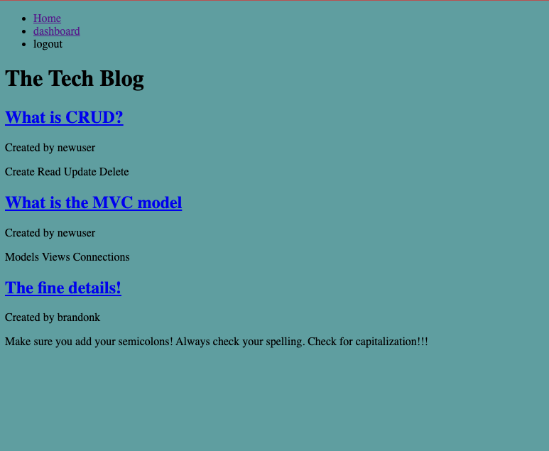

# Tech-Blog
A CMS-style blog site similar to a Wordpress site, where developers can publish their blog posts and comment on other developers’ posts as well.

[Click here](https://brandonk-tech-blog.herokuapp.com/) to see try it yourself!

## Description 
In this challenge I created the home page which shows the previous blog post, a user login/logout, and a user dashboard with the ability for the user to edit their own post.

This project (as of Dec. 1, 2022) is not fully complete but I am turning in what I have and plan to come back in the future once the course is over in 2 weeks and complete it. I have learned a lot from this challenge and am excited for more time on it in the future.

Future for this project

-Add the ability for a new user to comment on other users post.

-Style the page. Again, this is just due to time restraints and I am eager to get back to this project in the near future.

## Credits
---
- Thank you to the UTA-Bootcamp team.
- The Coding Collective
- Private tutor Scott Everett
- Private tutor David Elutilo

## License
---

Distributed under the MIT License. 

